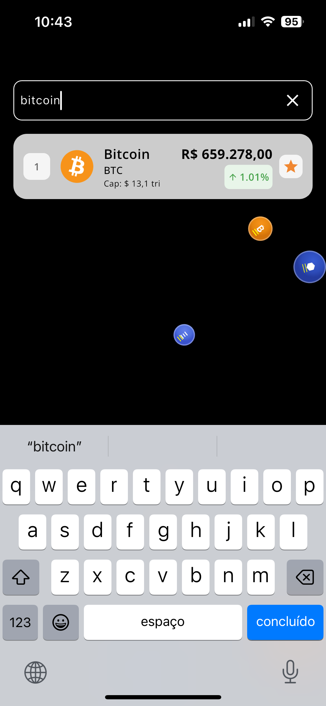
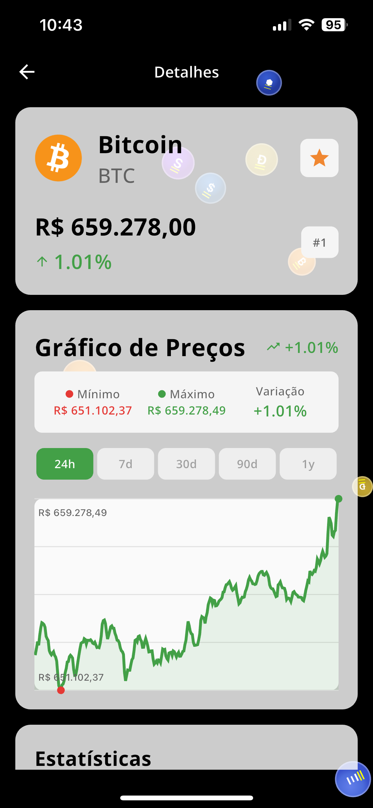
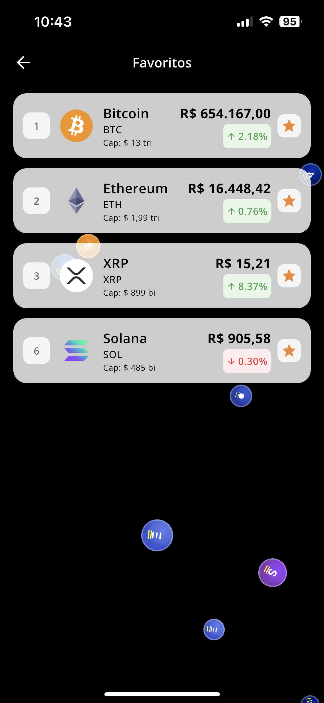

# Brasil Cripto 🇧🇷

Uma aplicação Flutter moderna para acompanhar preços de criptomoedas e gerenciar seus ativos digitais favoritos.

[🇺🇸 Read in English](README.md)

## ✨ Funcionalidades

### 🔍 **Busca e Descoberta de Criptomoedas**
- Pesquise qualquer criptomoeda por nome ou símbolo
- Navegue por criptomoedas em alta e populares
- Atualizações de preços em tempo real e dados de mercado
- Visualize rankings de capitalização de mercado e mudanças de preço em 24h

### 📊 **Gráficos de Preços Interativos**
- Gráficos de preços bonitos e interativos com suporte a toque
- Múltiplos períodos de tempo: 24h, 7d, 30d, 90d, 1a
- Indicadores de tendência de preços (mudanças positivas/negativas)
- Estatísticas do gráfico incluindo preços mín/máx e mudanças percentuais
- Geração de dados de gráfico de fallback para confiabilidade offline

### ❤️ **Gerenciamento de Favoritos**
- Adicione/remova criptomoedas à sua lista de favoritos
- Armazenamento persistente usando storage local seguro
- Acesso rápido às suas moedas preferidas
- Sincronização em tempo real em todo o aplicativo

### 🌐 **Internacionalização**
- Suporte a múltiplos idiomas (Inglês/Português)
- Formatação de moeda localizada
- Formatação adaptativa de data e números

### 🔒 **Segurança de Dados**
- Armazenamento local seguro para preferências do usuário
- Design focado em privacidade sem coleta de dados pessoais
- Capacidade offline com dados de fallback

## 🚀 Instalação

### Pré-requisitos
- Flutter SDK (>= 3.7.0)
- Dart SDK (>= 3.7.0)
- Android Studio / VS Code com extensões Flutter
- Dispositivo Android/iOS ou emulador

### Passo a Passo

1. **Clone o repositório**
   ```bash
   git clone https://github.com/yourusername/brasil-cripto.git
   cd brasil-cripto
   ```

2. **Instale as dependências**
   ```bash
   flutter pub get
   ```

3. **Gere os arquivos necessários**
   ```bash
   flutter packages pub run build_runner build
   ```

4. **Execute o aplicativo**
   ```bash
   # Para modo debug
   flutter run
   
   # Para modo release
   flutter run --release
   ```

### Build para Produção

**Android APK**
```bash
flutter build apk --release
```

**Android App Bundle**
```bash
flutter build appbundle --release
```

**iOS**
```bash
flutter build ios --release
```

## 🏗️ Estrutura do Projeto

```
lib/
├── main.dart                 # Ponto de entrada do app
├── app_widget.dart          # Widget principal do app
├── app_injector.dart        # Injeção de dependência
├── model/                   # Modelos de dados e repositórios
│   ├── models/             # Modelos de dados (CoinModel, CoinChartModel)
│   ├── repositories/       # Repositórios de dados
│   └── service/           # Serviços de API e cliente HTTP
├── view/                   # Componentes de UI
│   ├── pages/             # Páginas de tela
│   ├── widgets/           # Widgets reutilizáveis
│   └── utils/             # Utilitários de UI e roteamento
├── view_model/            # Lógica de negócio e gerenciamento de estado
│   ├── services/          # Serviços de negócio
│   └── utils/             # Utilitários (formatadores, storage)
└── l10n/                  # Arquivos de internacionalização
```

## 📱 Screenshots

| Página Inicial | Página de Busca | Detalhes da Moeda | Favoritos |
|----------------|-----------------|-------------------|-----------|
|  |  |  |  |
| 🏠 Navegue por criptomoedas em alta | 🔍 Pesquise por moedas específicas | 📊 Gráficos detalhados e estatísticas | ❤️ Gerencie suas moedas favoritas |

## 🔌 Integração com API

Este aplicativo usa a **API CoinGecko** para dados de criptomoedas:

### 📡 **API Gratuita com Limites de Taxa**
- **URL Base**: `https://api.coingecko.com/api/v3/`
- **Limite de Taxa**: 10-30 requisições por minuto (nível gratuito)
- **Dados incluem**: Preços atuais, capitalização de mercado, mudanças em 24h, dados históricos

### 🎯 **Endpoints Utilizados**
- `GET /coins/markets` - Obter dados de mercado de criptomoedas
- `GET /coins/{id}/market_chart` - Obter dados históricos de preços para gráficos

### ⚠️ **Notas Importantes**
- A API tem limitação de taxa no nível gratuito
- Se os limites de taxa forem excedidos, o app mostrará mensagens de erro apropriadas
- O app inclui geração de dados de gráfico de fallback quando as requisições da API falham

### 🔄 **Tratamento de Erros**
- Tratamento de erros de rede com mensagens amigáveis ao usuário
- Detecção de limite de taxa com sugestões de upgrade
- Mecanismos de retry automático
- Geração de dados de gráfico offline como fallback

## 🛠️ Tecnologias Utilizadas

- **Framework**: Flutter 3.7+
- **Linguagem**: Dart
- **Gerenciamento de Estado**: Provider + ChangeNotifier
- **Cliente HTTP**: Dio
- **Roteamento**: GoRouter
- **Armazenamento Local**: FlutterSecureStorage
- **Injeção de Dependência**: GetIt
- **Testes**: Mockito + FlutterTest
- **Internacionalização**: Flutter Intl
- **Programação Funcional**: Dartz (Either, Option)

## 🧪 Testes

Execute a suíte de testes:

```bash
# Execute todos os testes
flutter test

# Execute testes com cobertura
flutter test --coverage

# Execute testes de integração
flutter drive --target=test_driver/app.dart
```

O projeto inclui:
- Testes unitários para modelos e view models
- Testes de widget para componentes de UI
- Testes de integração para fluxos completos
- Serviços mock para testes isolados

## 📄 Licença

Este projeto está licenciado sob a Licença MIT - veja o arquivo [LICENSE](LICENSE) para detalhes.

## ⚡ Notas de Performance

- Gerenciamento eficiente de memória com dispose adequado de widgets
- Carregamento otimizado de imagens com cache
- Chamadas mínimas de API com estratégias de cache inteligentes
- Animações suaves com monitoramento adequado de performance

## 🙋‍♂️ Suporte

Se você tiver alguma dúvida ou precisar de ajuda, por favor:
1. Verifique a página de [Issues](https://github.com/yourusername/brasil-cripto/issues)
2. Crie uma nova issue com informações detalhadas
3. Sinta-se livre para entrar em contato comigo no meu email profissional.

---
